# Projects and dependencies analysis

This document provides a comprehensive overview of the projects and their dependencies in the context of upgrading to .NETCoreApp,Version=v10.0.

## Table of Contents

- [Executive Summary](#executive-Summary)
  - [Highlevel Metrics](#highlevel-metrics)
  - [Projects Compatibility](#projects-compatibility)
  - [Package Compatibility](#package-compatibility)
  - [API Compatibility](#api-compatibility)
- [Aggregate NuGet packages details](#aggregate-nuget-packages-details)
- [Top API Migration Challenges](#top-api-migration-challenges)
  - [Technologies and Features](#technologies-and-features)
  - [Most Frequent API Issues](#most-frequent-api-issues)
- [Projects Relationship Graph](#projects-relationship-graph)
- [Project Details](#project-details)

  - [BCKFreightTMS.Common\BCKFreightTMS.Common.csproj](#bckfreighttmscommonbckfreighttmscommoncsproj)
  - [Data\BCKFreightTMS.Data.Common\BCKFreightTMS.Data.Common.csproj](#databckfreighttmsdatacommonbckfreighttmsdatacommoncsproj)
  - [Data\BCKFreightTMS.Data.Models\BCKFreightTMS.Data.Models.csproj](#databckfreighttmsdatamodelsbckfreighttmsdatamodelscsproj)
  - [Data\BCKFreightTMS.Data\BCKFreightTMS.Data.csproj](#databckfreighttmsdatabckfreighttmsdatacsproj)
  - [Services\BCKFreightTMS.Services.Data\BCKFreightTMS.Services.Data.csproj](#servicesbckfreighttmsservicesdatabckfreighttmsservicesdatacsproj)
  - [Services\BCKFreightTMS.Services.Mapping\BCKFreightTMS.Services.Mapping.csproj](#servicesbckfreighttmsservicesmappingbckfreighttmsservicesmappingcsproj)
  - [Services\BCKFreightTMS.Services.Messaging\BCKFreightTMS.Services.Messaging.csproj](#servicesbckfreighttmsservicesmessagingbckfreighttmsservicesmessagingcsproj)
  - [Services\BCKFreightTMS.Services\BCKFreightTMS.Services.csproj](#servicesbckfreighttmsservicesbckfreighttmsservicescsproj)
  - [Tests\BCKFreightTMS.Services.Data.Tests\BCKFreightTMS.Services.Data.Tests.csproj](#testsbckfreighttmsservicesdatatestsbckfreighttmsservicesdatatestscsproj)
  - [Tests\BCKFreightTMS.Web.Tests\BCKFreightTMS.Web.Tests.csproj](#testsbckfreighttmswebtestsbckfreighttmswebtestscsproj)
  - [Tests\Sandbox\Sandbox.csproj](#testssandboxsandboxcsproj)
  - [Web\BCKFreightTMS.Web.ViewModels\BCKFreightTMS.Web.ViewModels.csproj](#webbckfreighttmswebviewmodelsbckfreighttmswebviewmodelscsproj)
  - [Web\BCKFreightTMS.Web\BCKFreightTMS.Web.csproj](#webbckfreighttmswebbckfreighttmswebcsproj)

## Executive Summary

### Highlevel Metrics

| Metric | Count | Status |
| :--- | :---: | :--- |
| Total Projects | 13 | All require upgrade |
| Total NuGet Packages | 39 | 16 need upgrade |
| Total Code Files | 430 |  |
| Total Code Files with Incidents | 25 |  |
| Total Lines of Code | 62471 |  |
| Total Number of Issues | 127 |  |
| Estimated LOC to modify | 74+ | at least 0.1% of codebase |

### Projects Compatibility

| Project | Target Framework | Difficulty | Package Issues | API Issues | Est. LOC Impact | Description |
| :--- | :---: | :---: | :---: | :---: | :---: | :--- |
| [BCKFreightTMS.Common\BCKFreightTMS.Common.csproj](#bckfreighttmscommonbckfreighttmscommoncsproj) | net6.0 | 🟢 Low | 1 | 0 |  | ClassLibrary, Sdk Style = True |
| [Data\BCKFreightTMS.Data.Common\BCKFreightTMS.Data.Common.csproj](#databckfreighttmsdatacommonbckfreighttmsdatacommoncsproj) | net6.0 | 🟢 Low | 2 | 0 |  | ClassLibrary, Sdk Style = True |
| [Data\BCKFreightTMS.Data.Models\BCKFreightTMS.Data.Models.csproj](#databckfreighttmsdatamodelsbckfreighttmsdatamodelscsproj) | net6.0 | 🟢 Low | 3 | 0 |  | ClassLibrary, Sdk Style = True |
| [Data\BCKFreightTMS.Data\BCKFreightTMS.Data.csproj](#databckfreighttmsdatabckfreighttmsdatacsproj) | net6.0 | 🟢 Low | 6 | 0 |  | ClassLibrary, Sdk Style = True |
| [Services\BCKFreightTMS.Services.Data\BCKFreightTMS.Services.Data.csproj](#servicesbckfreighttmsservicesdatabckfreighttmsservicesdatacsproj) | net6.0 | 🟢 Low | 1 | 1 | 1+ | ClassLibrary, Sdk Style = True |
| [Services\BCKFreightTMS.Services.Mapping\BCKFreightTMS.Services.Mapping.csproj](#servicesbckfreighttmsservicesmappingbckfreighttmsservicesmappingcsproj) | net6.0 | 🟢 Low | 1 | 0 |  | ClassLibrary, Sdk Style = True |
| [Services\BCKFreightTMS.Services.Messaging\BCKFreightTMS.Services.Messaging.csproj](#servicesbckfreighttmsservicesmessagingbckfreighttmsservicesmessagingcsproj) | net6.0 | 🟢 Low | 1 | 1 | 1+ | ClassLibrary, Sdk Style = True |
| [Services\BCKFreightTMS.Services\BCKFreightTMS.Services.csproj](#servicesbckfreighttmsservicesbckfreighttmsservicescsproj) | net6.0 | 🟢 Low | 1 | 40 | 40+ | ClassLibrary, Sdk Style = True |
| [Tests\BCKFreightTMS.Services.Data.Tests\BCKFreightTMS.Services.Data.Tests.csproj](#testsbckfreighttmsservicesdatatestsbckfreighttmsservicesdatatestscsproj) | net6.0 | 🟢 Low | 3 | 0 |  | DotNetCoreApp, Sdk Style = True |
| [Tests\BCKFreightTMS.Web.Tests\BCKFreightTMS.Web.Tests.csproj](#testsbckfreighttmswebtestsbckfreighttmswebtestscsproj) | net6.0 | 🟢 Low | 4 | 13 | 13+ | AspNetCore, Sdk Style = True |
| [Tests\Sandbox\Sandbox.csproj](#testssandboxsandboxcsproj) | net6.0 | 🟢 Low | 6 | 4 | 4+ | DotNetCoreApp, Sdk Style = True |
| [Web\BCKFreightTMS.Web.ViewModels\BCKFreightTMS.Web.ViewModels.csproj](#webbckfreighttmswebviewmodelsbckfreighttmswebviewmodelscsproj) | net6.0 | 🟢 Low | 1 | 0 |  | ClassLibrary, Sdk Style = True |
| [Web\BCKFreightTMS.Web\BCKFreightTMS.Web.csproj](#webbckfreighttmswebbckfreighttmswebcsproj) | net6.0 | 🟢 Low | 10 | 15 | 15+ | AspNetCore, Sdk Style = True |

### Package Compatibility

| Status | Count | Percentage |
| :--- | :---: | :---: |
| ✅ Compatible | 23 | 59.0% |
| ⚠️ Incompatible | 0 | 0.0% |
| 🔄 Upgrade Recommended | 16 | 41.0% |
| ***Total NuGet Packages*** | ***39*** | ***100%*** |

### API Compatibility

| Category | Count | Impact |
| :--- | :---: | :--- |
| 🔴 Binary Incompatible | 0 | High - Require code changes |
| 🟡 Source Incompatible | 61 | Medium - Needs re-compilation and potential conflicting API error fixing |
| 🔵 Behavioral change | 13 | Low - Behavioral changes that may require testing at runtime |
| ✅ Compatible | 157718 |  |
| ***Total APIs Analyzed*** | ***157792*** |  |

## Aggregate NuGet packages details

| Package | Current Version | Suggested Version | Projects | Description |
| :--- | :---: | :---: | :--- | :--- |
| AngleSharp | 0.16.1 |  | [BCKFreightTMS.Services.csproj](#servicesbckfreighttmsservicesbckfreighttmsservicescsproj) | ✅Compatible |
| AspNetCoreHero.ToastNotification | 1.1.0 |  | [BCKFreightTMS.Web.csproj](#webbckfreighttmswebbckfreighttmswebcsproj) | ✅Compatible |
| AutoMapper | 10.1.1 |  | [BCKFreightTMS.Services.Mapping.csproj](#servicesbckfreighttmsservicesmappingbckfreighttmsservicesmappingcsproj) [BCKFreightTMS.Web.csproj](#webbckfreighttmswebbckfreighttmswebcsproj) | ✅Compatible |
| BuildBundlerMinifier | 3.2.449 |  | [BCKFreightTMS.Web.csproj](#webbckfreighttmswebbckfreighttmswebcsproj) | ✅Compatible |
| CommandLineParser | 2.8.0 |  | [Sandbox.csproj](#testssandboxsandboxcsproj) | ✅Compatible |
| Microsoft.AspNetCore.Diagnostics.EntityFrameworkCore | 6.0.0 | 10.0.2 | [BCKFreightTMS.Web.csproj](#webbckfreighttmswebbckfreighttmswebcsproj) | NuGet package upgrade is recommended |
| Microsoft.AspNetCore.Http | 2.3.9 |  | [BCKFreightTMS.Services.csproj](#servicesbckfreighttmsservicesbckfreighttmsservicescsproj) [BCKFreightTMS.Services.Data.csproj](#servicesbckfreighttmsservicesdatabckfreighttmsservicesdatacsproj) [BCKFreightTMS.Services.Data.Tests.csproj](#testsbckfreighttmsservicesdatatestsbckfreighttmsservicesdatatestscsproj) [BCKFreightTMS.Web.csproj](#webbckfreighttmswebbckfreighttmswebcsproj) [BCKFreightTMS.Web.Tests.csproj](#testsbckfreighttmswebtestsbckfreighttmswebtestscsproj) [BCKFreightTMS.Web.ViewModels.csproj](#webbckfreighttmswebviewmodelsbckfreighttmswebviewmodelscsproj) [Sandbox.csproj](#testssandboxsandboxcsproj) | NuGet package functionality is included with framework reference |
| Microsoft.AspNetCore.Http.Abstractions | 2.3.9 |  | [BCKFreightTMS.Data.csproj](#databckfreighttmsdatabckfreighttmsdatacsproj) [BCKFreightTMS.Services.csproj](#servicesbckfreighttmsservicesbckfreighttmsservicescsproj) [BCKFreightTMS.Services.Data.csproj](#servicesbckfreighttmsservicesdatabckfreighttmsservicesdatacsproj) [BCKFreightTMS.Services.Data.Tests.csproj](#testsbckfreighttmsservicesdatatestsbckfreighttmsservicesdatatestscsproj) [BCKFreightTMS.Web.csproj](#webbckfreighttmswebbckfreighttmswebcsproj) [BCKFreightTMS.Web.Tests.csproj](#testsbckfreighttmswebtestsbckfreighttmswebtestscsproj) [BCKFreightTMS.Web.ViewModels.csproj](#webbckfreighttmswebviewmodelsbckfreighttmswebviewmodelscsproj) [Sandbox.csproj](#testssandboxsandboxcsproj) | NuGet package functionality is included with framework reference |
| Microsoft.AspNetCore.Identity.EntityFrameworkCore | 6.0.0 | 10.0.2 | [BCKFreightTMS.Data.csproj](#databckfreighttmsdatabckfreighttmsdatacsproj) [BCKFreightTMS.Data.Models.csproj](#databckfreighttmsdatamodelsbckfreighttmsdatamodelscsproj) [BCKFreightTMS.Web.csproj](#webbckfreighttmswebbckfreighttmswebcsproj) | NuGet package upgrade is recommended |
| Microsoft.AspNetCore.Identity.UI | 6.0.0 | 10.0.2 | [BCKFreightTMS.Web.csproj](#webbckfreighttmswebbckfreighttmswebcsproj) [Sandbox.csproj](#testssandboxsandboxcsproj) | NuGet package upgrade is recommended |
| Microsoft.AspNetCore.Mvc.Razor | 2.3.0 |  | [BCKFreightTMS.Services.csproj](#servicesbckfreighttmsservicesbckfreighttmsservicescsproj) | ✅Compatible |
| Microsoft.AspNetCore.Mvc.Razor.RuntimeCompilation | 6.0.0 | 10.0.2 | [BCKFreightTMS.Common.csproj](#bckfreighttmscommonbckfreighttmscommoncsproj) [BCKFreightTMS.Data.Common.csproj](#databckfreighttmsdatacommonbckfreighttmsdatacommoncsproj) [BCKFreightTMS.Data.csproj](#databckfreighttmsdatabckfreighttmsdatacsproj) [BCKFreightTMS.Data.Models.csproj](#databckfreighttmsdatamodelsbckfreighttmsdatamodelscsproj) [BCKFreightTMS.Services.csproj](#servicesbckfreighttmsservicesbckfreighttmsservicescsproj) [BCKFreightTMS.Services.Data.csproj](#servicesbckfreighttmsservicesdatabckfreighttmsservicesdatacsproj) [BCKFreightTMS.Services.Data.Tests.csproj](#testsbckfreighttmsservicesdatatestsbckfreighttmsservicesdatatestscsproj) [BCKFreightTMS.Services.Mapping.csproj](#servicesbckfreighttmsservicesmappingbckfreighttmsservicesmappingcsproj) [BCKFreightTMS.Services.Messaging.csproj](#servicesbckfreighttmsservicesmessagingbckfreighttmsservicesmessagingcsproj) [BCKFreightTMS.Web.csproj](#webbckfreighttmswebbckfreighttmswebcsproj) [BCKFreightTMS.Web.Tests.csproj](#testsbckfreighttmswebtestsbckfreighttmswebtestscsproj) [BCKFreightTMS.Web.ViewModels.csproj](#webbckfreighttmswebviewmodelsbckfreighttmswebviewmodelscsproj) [Sandbox.csproj](#testssandboxsandboxcsproj) | NuGet package upgrade is recommended |
| Microsoft.AspNetCore.Mvc.Testing | 6.0.0 | 10.0.2 | [BCKFreightTMS.Web.Tests.csproj](#testsbckfreighttmswebtestsbckfreighttmswebtestscsproj) | NuGet package upgrade is recommended |
| Microsoft.AspNetCore.Mvc.ViewFeatures | 2.3.0 |  | [BCKFreightTMS.Services.Data.csproj](#servicesbckfreighttmsservicesdatabckfreighttmsservicesdatacsproj) [BCKFreightTMS.Web.ViewModels.csproj](#webbckfreighttmswebviewmodelsbckfreighttmswebviewmodelscsproj) | ✅Compatible |
| Microsoft.EntityFrameworkCore.Design | 6.0.0 | 10.0.2 | [BCKFreightTMS.Data.csproj](#databckfreighttmsdatabckfreighttmsdatacsproj) [BCKFreightTMS.Data.Models.csproj](#databckfreighttmsdatamodelsbckfreighttmsdatamodelscsproj) [BCKFreightTMS.Services.Data.Tests.csproj](#testsbckfreighttmsservicesdatatestsbckfreighttmsservicesdatatestscsproj) | NuGet package upgrade is recommended |
| Microsoft.EntityFrameworkCore.InMemory | 6.0.0 | 10.0.2 | [BCKFreightTMS.Services.Data.Tests.csproj](#testsbckfreighttmsservicesdatatestsbckfreighttmsservicesdatatestscsproj) | NuGet package upgrade is recommended |
| Microsoft.EntityFrameworkCore.Proxies | 6.0.0 | 10.0.2 | [BCKFreightTMS.Web.csproj](#webbckfreighttmswebbckfreighttmswebcsproj) | NuGet package upgrade is recommended |
| Microsoft.EntityFrameworkCore.SqlServer | 6.0.0 | 10.0.2 | [BCKFreightTMS.Data.csproj](#databckfreighttmsdatabckfreighttmsdatacsproj) [BCKFreightTMS.Web.csproj](#webbckfreighttmswebbckfreighttmswebcsproj) | NuGet package upgrade is recommended |
| Microsoft.EntityFrameworkCore.Tools | 6.0.0 | 10.0.2 | [BCKFreightTMS.Data.csproj](#databckfreighttmsdatabckfreighttmsdatacsproj) [BCKFreightTMS.Web.csproj](#webbckfreighttmswebbckfreighttmswebcsproj) | NuGet package upgrade is recommended |
| Microsoft.Extensions.Configuration | 6.0.0 | 10.0.2 | [Sandbox.csproj](#testssandboxsandboxcsproj) | NuGet package upgrade is recommended |
| Microsoft.Extensions.Configuration.EnvironmentVariables | 6.0.0 | 10.0.2 | [Sandbox.csproj](#testssandboxsandboxcsproj) | NuGet package upgrade is recommended |
| Microsoft.Extensions.Configuration.Json | 6.0.0 | 10.0.2 | [Sandbox.csproj](#testssandboxsandboxcsproj) | NuGet package upgrade is recommended |
| Microsoft.Extensions.Configuration.UserSecrets | 6.0.0 | 10.0.2 | [BCKFreightTMS.Data.csproj](#databckfreighttmsdatabckfreighttmsdatacsproj) | NuGet package upgrade is recommended |
| Microsoft.Extensions.Logging.Console | 6.0.0 | 10.0.2 | [Sandbox.csproj](#testssandboxsandboxcsproj) | NuGet package upgrade is recommended |
| Microsoft.NET.Test.Sdk | 17.0.0 |  | [BCKFreightTMS.Services.Data.Tests.csproj](#testsbckfreighttmsservicesdatatestsbckfreighttmsservicesdatatestscsproj) [BCKFreightTMS.Web.Tests.csproj](#testsbckfreighttmswebtestsbckfreighttmswebtestscsproj) | ✅Compatible |
| Microsoft.VisualStudio.Web.CodeGeneration.Design | 6.0.0 | 10.0.2 | [BCKFreightTMS.Web.csproj](#webbckfreighttmswebbckfreighttmswebcsproj) | NuGet package upgrade is recommended |
| Microsoft.Web.LibraryManager.Build | 2.1.113 |  | [BCKFreightTMS.Web.csproj](#webbckfreighttmswebbckfreighttmswebcsproj) | ✅Compatible |
| Moq | 4.16.1 |  | [BCKFreightTMS.Services.Data.Tests.csproj](#testsbckfreighttmsservicesdatatestsbckfreighttmsservicesdatatestscsproj) | ✅Compatible |
| Select.HtmlToPdf.NetCore | 20.2.0 |  | [BCKFreightTMS.Services.csproj](#servicesbckfreighttmsservicesbckfreighttmsservicescsproj) | ✅Compatible |
| Selenium.Support | 4.0.0-alpha07 |  | [BCKFreightTMS.Web.Tests.csproj](#testsbckfreighttmswebtestsbckfreighttmswebtestscsproj) | ✅Compatible |
| Selenium.WebDriver | 4.0.0-alpha07 |  | [BCKFreightTMS.Web.Tests.csproj](#testsbckfreighttmswebtestsbckfreighttmswebtestscsproj) | ✅Compatible |
| Selenium.WebDriver.ChromeDriver | 89.0.4389.2300 |  | [BCKFreightTMS.Web.Tests.csproj](#testsbckfreighttmswebtestsbckfreighttmswebtestscsproj) | ✅Compatible |
| Sendgrid | 9.25.0 |  | [BCKFreightTMS.Services.Messaging.csproj](#servicesbckfreighttmsservicesmessagingbckfreighttmsservicesmessagingcsproj) | ✅Compatible |
| StyleCop.Analyzers | 1.2.0-beta.205 |  | [BCKFreightTMS.Common.csproj](#bckfreighttmscommonbckfreighttmscommoncsproj) [BCKFreightTMS.Data.Common.csproj](#databckfreighttmsdatacommonbckfreighttmsdatacommoncsproj) [BCKFreightTMS.Data.csproj](#databckfreighttmsdatabckfreighttmsdatacsproj) [BCKFreightTMS.Data.Models.csproj](#databckfreighttmsdatamodelsbckfreighttmsdatamodelscsproj) [BCKFreightTMS.Services.csproj](#servicesbckfreighttmsservicesbckfreighttmsservicescsproj) [BCKFreightTMS.Services.Data.csproj](#servicesbckfreighttmsservicesdatabckfreighttmsservicesdatacsproj) [BCKFreightTMS.Services.Data.Tests.csproj](#testsbckfreighttmsservicesdatatestsbckfreighttmsservicesdatatestscsproj) [BCKFreightTMS.Services.Mapping.csproj](#servicesbckfreighttmsservicesmappingbckfreighttmsservicesmappingcsproj) [BCKFreightTMS.Services.Messaging.csproj](#servicesbckfreighttmsservicesmessagingbckfreighttmsservicesmessagingcsproj) [BCKFreightTMS.Web.csproj](#webbckfreighttmswebbckfreighttmswebcsproj) [BCKFreightTMS.Web.Tests.csproj](#testsbckfreighttmswebtestsbckfreighttmswebtestscsproj) [BCKFreightTMS.Web.ViewModels.csproj](#webbckfreighttmswebviewmodelsbckfreighttmswebviewmodelscsproj) [Sandbox.csproj](#testssandboxsandboxcsproj) | ✅Compatible |
| System.ComponentModel.Annotations | 5.0.0.0 |  | [BCKFreightTMS.Data.Common.csproj](#databckfreighttmsdatacommonbckfreighttmsdatacommoncsproj) | NuGet package functionality is included with framework reference |
| System.Linq.Dynamic.Core | 1.7.1 |  | [BCKFreightTMS.Services.Data.csproj](#servicesbckfreighttmsservicesdatabckfreighttmsservicesdatacsproj) [BCKFreightTMS.Web.csproj](#webbckfreighttmswebbckfreighttmswebcsproj) | ✅Compatible |
| Tesseract | 4.1.1 |  | [BCKFreightTMS.Services.csproj](#servicesbckfreighttmsservicesbckfreighttmsservicescsproj) | ✅Compatible |
| xunit | 2.4.1 |  | [BCKFreightTMS.Services.Data.Tests.csproj](#testsbckfreighttmsservicesdatatestsbckfreighttmsservicesdatatestscsproj) [BCKFreightTMS.Web.Tests.csproj](#testsbckfreighttmswebtestsbckfreighttmswebtestscsproj) | ✅Compatible |
| xunit.runner.visualstudio | 2.4.3 |  | [BCKFreightTMS.Services.Data.Tests.csproj](#testsbckfreighttmsservicesdatatestsbckfreighttmsservicesdatatestscsproj) [BCKFreightTMS.Web.Tests.csproj](#testsbckfreighttmswebtestsbckfreighttmswebtestscsproj) | ✅Compatible |

## Top API Migration Challenges

### Technologies and Features

| Technology | Issues | Percentage | Migration Path |
| :--- | :---: | :---: | :--- |
| GDI+ / System.Drawing | 44 | 59.5% | System.Drawing APIs for 2D graphics, imaging, and printing that are available via NuGet package System.Drawing.Common. Note: Not recommended for server scenarios due to Windows dependencies; consider cross-platform alternatives like SkiaSharp or ImageSharp for new code. |

### Most Frequent API Issues

| API | Count | Percentage | Category |
| :--- | :---: | :---: | :--- |
| T:System.Drawing.Bitmap | 11 | 14.9% | Source Incompatible |
| T:System.Drawing.Image | 8 | 10.8% | Source Incompatible |
| T:System.Uri | 4 | 5.4% | Behavioral Change |
| T:System.Drawing.Imaging.ImageCodecInfo | 3 | 4.1% | Source Incompatible |
| T:System.Net.Http.HttpContent | 3 | 4.1% | Behavioral Change |
| T:System.Drawing.Imaging.Encoder | 2 | 2.7% | Source Incompatible |
| T:System.Drawing.Imaging.PixelFormat | 2 | 2.7% | Source Incompatible |
| T:System.Xml.Serialization.XmlSerializer | 2 | 2.7% | Behavioral Change |
| T:Microsoft.Extensions.DependencyInjection.IdentityServiceCollectionUIExtensions | 2 | 2.7% | Source Incompatible |
| M:Microsoft.Extensions.DependencyInjection.IdentityServiceCollectionUIExtensions.AddDefaultIdentity''1(Microsoft.Extensions.DependencyInjection.IServiceCollection,System.Action{Microsoft.AspNetCore.Identity.IdentityOptions}) | 2 | 2.7% | Source Incompatible |
| T:Microsoft.Extensions.DependencyInjection.IdentityEntityFrameworkBuilderExtensions | 2 | 2.7% | Source Incompatible |
| M:Microsoft.Extensions.DependencyInjection.IdentityEntityFrameworkBuilderExtensions.AddEntityFrameworkStores''1(Microsoft.AspNetCore.Identity.IdentityBuilder) | 2 | 2.7% | Source Incompatible |
| T:Microsoft.AspNetCore.Hosting.WebHostBuilder | 2 | 2.7% | Source Incompatible |
| T:Microsoft.AspNetCore.WebHost | 2 | 2.7% | Source Incompatible |
| T:Microsoft.AspNetCore.Hosting.IWebHost | 2 | 2.7% | Source Incompatible |
| M:System.Uri.#ctor(System.String) | 2 | 2.7% | Behavioral Change |
| T:System.Text.Json.JsonDocument | 1 | 1.4% | Behavioral Change |
| M:System.Drawing.Image.Save(System.String,System.Drawing.Imaging.ImageCodecInfo,System.Drawing.Imaging.EncoderParameters) | 1 | 1.4% | Source Incompatible |
| P:System.Drawing.Imaging.EncoderParameters.Param | 1 | 1.4% | Source Incompatible |
| T:System.Drawing.Imaging.EncoderParameters | 1 | 1.4% | Source Incompatible |
| M:System.Drawing.Imaging.EncoderParameters.#ctor(System.Int32) | 1 | 1.4% | Source Incompatible |
| F:System.Drawing.Imaging.Encoder.Quality | 1 | 1.4% | Source Incompatible |
| T:System.Drawing.Imaging.EncoderParameter | 1 | 1.4% | Source Incompatible |
| M:System.Drawing.Imaging.EncoderParameter.#ctor(System.Drawing.Imaging.Encoder,System.Int64) | 1 | 1.4% | Source Incompatible |
| P:System.Drawing.Imaging.ImageCodecInfo.MimeType | 1 | 1.4% | Source Incompatible |
| M:System.Drawing.Imaging.ImageCodecInfo.GetImageEncoders | 1 | 1.4% | Source Incompatible |
| M:System.Drawing.Image.GetThumbnailImage(System.Int32,System.Int32,System.Drawing.Image.GetThumbnailImageAbort,System.IntPtr) | 1 | 1.4% | Source Incompatible |
| M:System.Drawing.Bitmap.SetResolution(System.Single,System.Single) | 1 | 1.4% | Source Incompatible |
| F:System.Drawing.Imaging.PixelFormat.Format24bppRgb | 1 | 1.4% | Source Incompatible |
| M:System.Drawing.Bitmap.#ctor(System.Int32,System.Int32,System.Drawing.Imaging.PixelFormat) | 1 | 1.4% | Source Incompatible |
| P:System.Drawing.Image.Height | 1 | 1.4% | Source Incompatible |
| P:System.Drawing.Image.Width | 1 | 1.4% | Source Incompatible |
| M:System.TimeSpan.FromDays(System.Double) | 1 | 1.4% | Source Incompatible |
| M:System.TimeSpan.FromMinutes(System.Double) | 1 | 1.4% | Source Incompatible |
| T:System.Drawing.Imaging.ImageFormat | 1 | 1.4% | Source Incompatible |
| P:System.Drawing.Image.RawFormat | 1 | 1.4% | Source Incompatible |
| M:System.Drawing.Image.Save(System.IO.Stream,System.Drawing.Imaging.ImageFormat) | 1 | 1.4% | Source Incompatible |
| M:Microsoft.AspNetCore.Builder.ExceptionHandlerExtensions.UseExceptionHandler(Microsoft.AspNetCore.Builder.IApplicationBuilder,System.String) | 1 | 1.4% | Behavioral Change |
| M:Microsoft.Extensions.DependencyInjection.RazorRuntimeCompilationMvcBuilderExtensions.AddRazorRuntimeCompilation(Microsoft.Extensions.DependencyInjection.IMvcBuilder) | 1 | 1.4% | Source Incompatible |

## Projects Relationship Graph

Legend:
📦 SDK-style project
⚙️ Classic project

```mermaid
flowchart LR
    P1["<b>📦&nbsp;BCKFreightTMS.Web.csproj</b><br/><small>net6.0</small>"]
    P2["<b>📦&nbsp;BCKFreightTMS.Data.Models.csproj</b><br/><small>net6.0</small>"]
    P3["<b>📦&nbsp;BCKFreightTMS.Services.csproj</b><br/><small>net6.0</small>"]
    P4["<b>📦&nbsp;BCKFreightTMS.Services.Messaging.csproj</b><br/><small>net6.0</small>"]
    P5["<b>📦&nbsp;BCKFreightTMS.Data.csproj</b><br/><small>net6.0</small>"]
    P6["<b>📦&nbsp;BCKFreightTMS.Data.Common.csproj</b><br/><small>net6.0</small>"]
    P7["<b>📦&nbsp;BCKFreightTMS.Common.csproj</b><br/><small>net6.0</small>"]
    P8["<b>📦&nbsp;BCKFreightTMS.Services.Data.csproj</b><br/><small>net6.0</small>"]
    P9["<b>📦&nbsp;BCKFreightTMS.Services.Mapping.csproj</b><br/><small>net6.0</small>"]
    P10["<b>📦&nbsp;Sandbox.csproj</b><br/><small>net6.0</small>"]
    P11["<b>📦&nbsp;BCKFreightTMS.Services.Data.Tests.csproj</b><br/><small>net6.0</small>"]
    P12["<b>📦&nbsp;BCKFreightTMS.Web.Tests.csproj</b><br/><small>net6.0</small>"]
    P13["<b>📦&nbsp;BCKFreightTMS.Web.ViewModels.csproj</b><br/><small>net6.0</small>"]
    P1 --> P8
    P1 --> P3
    P1 --> P13
    P1 --> P9
    P1 --> P4
    P1 --> P2
    P1 --> P5
    P2 --> P7
    P2 --> P6
    P3 --> P7
    P3 --> P13
    P5 --> P7
    P5 --> P6
    P5 --> P2
    P8 --> P7
    P8 --> P13
    P8 --> P9
    P8 --> P3
    P8 --> P6
    P8 --> P4
    P8 --> P2
    P8 --> P5
    P10 --> P7
    P10 --> P8
    P10 --> P3
    P10 --> P9
    P10 --> P4
    P10 --> P6
    P10 --> P2
    P10 --> P5
    P11 --> P8
    P11 --> P5
    P12 --> P1
    P13 --> P7
    P13 --> P9
    P13 --> P2
    click P1 "#webbckfreighttmswebbckfreighttmswebcsproj"
    click P2 "#databckfreighttmsdatamodelsbckfreighttmsdatamodelscsproj"
    click P3 "#servicesbckfreighttmsservicesbckfreighttmsservicescsproj"
    click P4 "#servicesbckfreighttmsservicesmessagingbckfreighttmsservicesmessagingcsproj"
    click P5 "#databckfreighttmsdatabckfreighttmsdatacsproj"
    click P6 "#databckfreighttmsdatacommonbckfreighttmsdatacommoncsproj"
    click P7 "#bckfreighttmscommonbckfreighttmscommoncsproj"
    click P8 "#servicesbckfreighttmsservicesdatabckfreighttmsservicesdatacsproj"
    click P9 "#servicesbckfreighttmsservicesmappingbckfreighttmsservicesmappingcsproj"
    click P10 "#testssandboxsandboxcsproj"
    click P11 "#testsbckfreighttmsservicesdatatestsbckfreighttmsservicesdatatestscsproj"
    click P12 "#testsbckfreighttmswebtestsbckfreighttmswebtestscsproj"
    click P13 "#webbckfreighttmswebviewmodelsbckfreighttmswebviewmodelscsproj"

```

## Project Details

### BCKFreightTMS.Common\BCKFreightTMS.Common.csproj

#### Project Info

- **Current Target Framework:** net6.0
- **Proposed Target Framework:** net10.0
- **SDK-style**: True
- **Project Kind:** ClassLibrary
- **Dependencies**: 0
- **Dependants**: 6
- **Number of Files**: 21
- **Number of Files with Incidents**: 1
- **Lines of Code**: 397
- **Estimated LOC to modify**: 0+ (at least 0.0% of the project)

#### Dependency Graph

Legend:
📦 SDK-style project
⚙️ Classic project

```mermaid
flowchart TB
    subgraph upstream["Dependants (6)"]
        P2["<b>📦&nbsp;BCKFreightTMS.Data.Models.csproj</b><br/><small>net6.0</small>"]
        P3["<b>📦&nbsp;BCKFreightTMS.Services.csproj</b><br/><small>net6.0</small>"]
        P5["<b>📦&nbsp;BCKFreightTMS.Data.csproj</b><br/><small>net6.0</small>"]
        P8["<b>📦&nbsp;BCKFreightTMS.Services.Data.csproj</b><br/><small>net6.0</small>"]
        P10["<b>📦&nbsp;Sandbox.csproj</b><br/><small>net6.0</small>"]
        P13["<b>📦&nbsp;BCKFreightTMS.Web.ViewModels.csproj</b><br/><small>net6.0</small>"]
        click P2 "#databckfreighttmsdatamodelsbckfreighttmsdatamodelscsproj"
        click P3 "#servicesbckfreighttmsservicesbckfreighttmsservicescsproj"
        click P5 "#databckfreighttmsdatabckfreighttmsdatacsproj"
        click P8 "#servicesbckfreighttmsservicesdatabckfreighttmsservicesdatacsproj"
        click P10 "#testssandboxsandboxcsproj"
        click P13 "#webbckfreighttmswebviewmodelsbckfreighttmswebviewmodelscsproj"
    end
    subgraph current["BCKFreightTMS.Common.csproj"]
        MAIN["<b>📦&nbsp;BCKFreightTMS.Common.csproj</b><br/><small>net6.0</small>"]
        click MAIN "#bckfreighttmscommonbckfreighttmscommoncsproj"
    end
    P2 --> MAIN
    P3 --> MAIN
    P5 --> MAIN
    P8 --> MAIN
    P10 --> MAIN
    P13 --> MAIN

```

### API Compatibility

| Category | Count | Impact |
| :--- | :---: | :--- |
| 🔴 Binary Incompatible | 0 | High - Require code changes |
| 🟡 Source Incompatible | 0 | Medium - Needs re-compilation and potential conflicting API error fixing |
| 🔵 Behavioral change | 0 | Low - Behavioral changes that may require testing at runtime |
| ✅ Compatible | 31 |  |
| ***Total APIs Analyzed*** | ***31*** |  |

### Data\BCKFreightTMS.Data.Common\BCKFreightTMS.Data.Common.csproj

#### Project Info

- **Current Target Framework:** net6.0
- **Proposed Target Framework:** net10.0
- **SDK-style**: True
- **Project Kind:** ClassLibrary
- **Dependencies**: 0
- **Dependants**: 4
- **Number of Files**: 9
- **Number of Files with Incidents**: 1
- **Lines of Code**: 119
- **Estimated LOC to modify**: 0+ (at least 0.0% of the project)

#### Dependency Graph

Legend:
📦 SDK-style project
⚙️ Classic project

### API Compatibility

| Category | Count | Impact |
| :--- | :---: | :--- |
| 🔴 Binary Incompatible | 0 | High - Require code changes |
| 🟡 Source Incompatible | 0 | Medium - Needs re-compilation and potential conflicting API error fixing |
| 🔵 Behavioral change | 0 | Low - Behavioral changes that may require testing at runtime |
| ✅ Compatible | 62 |  |
| ***Total APIs Analyzed*** | ***62*** |  |

### Data\BCKFreightTMS.Data.Models\BCKFreightTMS.Data.Models.csproj

#### Project Info

- **Current Target Framework:** net6.0
- **Proposed Target Framework:** net10.0
- **SDK-style**: True
- **Project Kind:** ClassLibrary
- **Dependencies**: 2
- **Dependants**: 5
- **Number of Files**: 35
- **Number of Files with Incidents**: 1
- **Lines of Code**: 1238
- **Estimated LOC to modify**: 0+ (at least 0.0% of the project)

#### Dependency Graph

Legend:
📦 SDK-style project
⚙️ Classic project

```mermaid
flowchart TB
    subgraph upstream["Dependants (5)"]
        P1["<b>📦&nbsp;BCKFreightTMS.Web.csproj</b><br/><small>net6.0</small>"]
        P5["<b>📦&nbsp;BCKFreightTMS.Data.csproj</b><br/><small>net6.0</small>"]
        P8["<b>📦&nbsp;BCKFreightTMS.Services.Data.csproj</b><br/><small>net6.0</small>"]
        P10["<b>📦&nbsp;Sandbox.csproj</b><br/><small>net6.0</small>"]
        P13["<b>📦&nbsp;BCKFreightTMS.Web.ViewModels.csproj</b><br/><small>net6.0</small>"]
        click P1 "#webbckfreighttmswebbckfreighttmswebcsproj"
        click P5 "#databckfreighttmsdatabckfreighttmsdatacsproj"
        click P8 "#servicesbckfreighttmsservicesdatabckfreighttmsservicesdatacsproj"
        click P10 "#testssandboxsandboxcsproj"
        click P13 "#webbckfreighttmswebviewmodelsbckfreighttmswebviewmodelscsproj"
    end
    subgraph current["BCKFreightTMS.Data.Models.csproj"]
        MAIN["<b>📦&nbsp;BCKFreightTMS.Data.Models.csproj</b><br/><small>net6.0</small>"]
        click MAIN "#databckfreighttmsdatamodelsbckfreighttmsdatamodelscsproj"
    end
    subgraph downstream["Dependencies (2"]
        P7["<b>📦&nbsp;BCKFreightTMS.Common.csproj</b><br/><small>net6.0</small>"]
        P6["<b>📦&nbsp;BCKFreightTMS.Data.Common.csproj</b><br/><small>net6.0</small>"]
        click P7 "#bckfreighttmscommonbckfreighttmscommoncsproj"
        click P6 "#databckfreighttmsdatacommonbckfreighttmsdatacommoncsproj"
    end
    P1 --> MAIN
    P5 --> MAIN
    P8 --> MAIN
    P10 --> MAIN
    P13 --> MAIN
    MAIN --> P7
    MAIN --> P6

```

### API Compatibility

| Category | Count | Impact |
| :--- | :---: | :--- |
| 🔴 Binary Incompatible | 0 | High - Require code changes |
| 🟡 Source Incompatible | 0 | Medium - Needs re-compilation and potential conflicting API error fixing |
| 🔵 Behavioral change | 0 | Low - Behavioral changes that may require testing at runtime |
| ✅ Compatible | 1688 |  |
| ***Total APIs Analyzed*** | ***1688*** |  |

### Data\BCKFreightTMS.Data\BCKFreightTMS.Data.csproj

#### Project Info

- **Current Target Framework:** net6.0
- **Proposed Target Framework:** net10.0
- **SDK-style**: True
- **Project Kind:** ClassLibrary
- **Dependencies**: 3
- **Dependants**: 4
- **Number of Files**: 62
- **Number of Files with Incidents**: 1
- **Lines of Code**: 39793
- **Estimated LOC to modify**: 0+ (at least 0.0% of the project)

#### Dependency Graph

Legend:
📦 SDK-style project
⚙️ Classic project

```mermaid
flowchart TB
    subgraph upstream["Dependants (4)"]
        P1["<b>📦&nbsp;BCKFreightTMS.Web.csproj</b><br/><small>net6.0</small>"]
        P8["<b>📦&nbsp;BCKFreightTMS.Services.Data.csproj</b><br/><small>net6.0</small>"]
        P10["<b>📦&nbsp;Sandbox.csproj</b><br/><small>net6.0</small>"]
        P11["<b>📦&nbsp;BCKFreightTMS.Services.Data.Tests.csproj</b><br/><small>net6.0</small>"]
        click P1 "#webbckfreighttmswebbckfreighttmswebcsproj"
        click P8 "#servicesbckfreighttmsservicesdatabckfreighttmsservicesdatacsproj"
        click P10 "#testssandboxsandboxcsproj"
        click P11 "#testsbckfreighttmsservicesdatatestsbckfreighttmsservicesdatatestscsproj"
    end
    subgraph current["BCKFreightTMS.Data.csproj"]
        MAIN["<b>📦&nbsp;BCKFreightTMS.Data.csproj</b><br/><small>net6.0</small>"]
        click MAIN "#databckfreighttmsdatabckfreighttmsdatacsproj"
    end
    subgraph downstream["Dependencies (3"]
        P7["<b>📦&nbsp;BCKFreightTMS.Common.csproj</b><br/><small>net6.0</small>"]
        P6["<b>📦&nbsp;BCKFreightTMS.Data.Common.csproj</b><br/><small>net6.0</small>"]
        P2["<b>📦&nbsp;BCKFreightTMS.Data.Models.csproj</b><br/><small>net6.0</small>"]
        click P7 "#bckfreighttmscommonbckfreighttmscommoncsproj"
        click P6 "#databckfreighttmsdatacommonbckfreighttmsdatacommoncsproj"
        click P2 "#databckfreighttmsdatamodelsbckfreighttmsdatamodelscsproj"
    end
    P1 --> MAIN
    P8 --> MAIN
    P10 --> MAIN
    P11 --> MAIN
    MAIN --> P7
    MAIN --> P6
    MAIN --> P2

```

### API Compatibility

| Category | Count | Impact |
| :--- | :---: | :--- |
| 🔴 Binary Incompatible | 0 | High - Require code changes |
| 🟡 Source Incompatible | 0 | Medium - Needs re-compilation and potential conflicting API error fixing |
| 🔵 Behavioral change | 0 | Low - Behavioral changes that may require testing at runtime |
| ✅ Compatible | 56414 |  |
| ***Total APIs Analyzed*** | ***56414*** |  |

### Services\BCKFreightTMS.Services.Data\BCKFreightTMS.Services.Data.csproj

#### Project Info

- **Current Target Framework:** net6.0
- **Proposed Target Framework:** net10.0
- **SDK-style**: True
- **Project Kind:** ClassLibrary
- **Dependencies**: 8
- **Dependants**: 3
- **Number of Files**: 16
- **Number of Files with Incidents**: 2
- **Lines of Code**: 2510
- **Estimated LOC to modify**: 1+ (at least 0.0% of the project)

#### Dependency Graph

Legend:
📦 SDK-style project
⚙️ Classic project

### API Compatibility

| Category | Count | Impact |
| :--- | :---: | :--- |
| 🔴 Binary Incompatible | 0 | High - Require code changes |
| 🟡 Source Incompatible | 0 | Medium - Needs re-compilation and potential conflicting API error fixing |
| 🔵 Behavioral change | 1 | Low - Behavioral changes that may require testing at runtime |
| ✅ Compatible | 3098 |  |
| ***Total APIs Analyzed*** | ***3099*** |  |

### Services\BCKFreightTMS.Services.Mapping\BCKFreightTMS.Services.Mapping.csproj

#### Project Info

- **Current Target Framework:** net6.0
- **Proposed Target Framework:** net10.0
- **SDK-style**: True
- **Project Kind:** ClassLibrary
- **Dependencies**: 0
- **Dependants**: 4
- **Number of Files**: 7
- **Number of Files with Incidents**: 1
- **Lines of Code**: 197
- **Estimated LOC to modify**: 0+ (at least 0.0% of the project)

#### Dependency Graph

Legend:
📦 SDK-style project
⚙️ Classic project

```mermaid
flowchart TB
    subgraph upstream["Dependants (4)"]
        P1["<b>📦&nbsp;BCKFreightTMS.Web.csproj</b><br/><small>net6.0</small>"]
        P8["<b>📦&nbsp;BCKFreightTMS.Services.Data.csproj</b><br/><small>net6.0</small>"]
        P10["<b>📦&nbsp;Sandbox.csproj</b><br/><small>net6.0</small>"]
        P13["<b>📦&nbsp;BCKFreightTMS.Web.ViewModels.csproj</b><br/><small>net6.0</small>"]
        click P1 "#webbckfreighttmswebbckfreighttmswebcsproj"
        click P8 "#servicesbckfreighttmsservicesdatabckfreighttmsservicesdatacsproj"
        click P10 "#testssandboxsandboxcsproj"
        click P13 "#webbckfreighttmswebviewmodelsbckfreighttmswebviewmodelscsproj"
    end
    subgraph current["BCKFreightTMS.Services.Mapping.csproj"]
        MAIN["<b>📦&nbsp;BCKFreightTMS.Services.Mapping.csproj</b><br/><small>net6.0</small>"]
        click MAIN "#servicesbckfreighttmsservicesmappingbckfreighttmsservicesmappingcsproj"
    end
    P1 --> MAIN
    P8 --> MAIN
    P10 --> MAIN
    P13 --> MAIN

```

### API Compatibility

| Category | Count | Impact |
| :--- | :---: | :--- |
| 🔴 Binary Incompatible | 0 | High - Require code changes |
| 🟡 Source Incompatible | 0 | Medium - Needs re-compilation and potential conflicting API error fixing |
| 🔵 Behavioral change | 0 | Low - Behavioral changes that may require testing at runtime |
| ✅ Compatible | 215 |  |
| ***Total APIs Analyzed*** | ***215*** |  |

### Services\BCKFreightTMS.Services.Messaging\BCKFreightTMS.Services.Messaging.csproj

#### Project Info

- **Current Target Framework:** net6.0
- **Proposed Target Framework:** net10.0
- **SDK-style**: True
- **Project Kind:** ClassLibrary
- **Dependencies**: 0
- **Dependants**: 3
- **Number of Files**: 5
- **Number of Files with Incidents**: 2
- **Lines of Code**: 106
- **Estimated LOC to modify**: 1+ (at least 0.9% of the project)

#### Dependency Graph

Legend:
📦 SDK-style project
⚙️ Classic project

```mermaid
flowchart TB
    subgraph upstream["Dependants (3)"]
        P1["<b>📦&nbsp;BCKFreightTMS.Web.csproj</b><br/><small>net6.0</small>"]
        P8["<b>📦&nbsp;BCKFreightTMS.Services.Data.csproj</b><br/><small>net6.0</small>"]
        P10["<b>📦&nbsp;Sandbox.csproj</b><br/><small>net6.0</small>"]
        click P1 "#webbckfreighttmswebbckfreighttmswebcsproj"
        click P8 "#servicesbckfreighttmsservicesdatabckfreighttmsservicesdatacsproj"
        click P10 "#testssandboxsandboxcsproj"
    end
    subgraph current["BCKFreightTMS.Services.Messaging.csproj"]
        MAIN["<b>📦&nbsp;BCKFreightTMS.Services.Messaging.csproj</b><br/><small>net6.0</small>"]
        click MAIN "#servicesbckfreighttmsservicesmessagingbckfreighttmsservicesmessagingcsproj"
    end
    P1 --> MAIN
    P8 --> MAIN
    P10 --> MAIN

```

### API Compatibility

| Category | Count | Impact |
| :--- | :---: | :--- |
| 🔴 Binary Incompatible | 0 | High - Require code changes |
| 🟡 Source Incompatible | 0 | Medium - Needs re-compilation and potential conflicting API error fixing |
| 🔵 Behavioral change | 1 | Low - Behavioral changes that may require testing at runtime |
| ✅ Compatible | 98 |  |
| ***Total APIs Analyzed*** | ***99*** |  |

### Services\BCKFreightTMS.Services\BCKFreightTMS.Services.csproj

#### Project Info

- **Current Target Framework:** net6.0
- **Proposed Target Framework:** net10.0
- **SDK-style**: True
- **Project Kind:** ClassLibrary
- **Dependencies**: 2
- **Dependants**: 3
- **Number of Files**: 10
- **Number of Files with Incidents**: 3
- **Lines of Code**: 603
- **Estimated LOC to modify**: 40+ (at least 6.6% of the project)

#### Dependency Graph

Legend:
📦 SDK-style project
⚙️ Classic project

```mermaid
flowchart TB
    subgraph upstream["Dependants (3)"]
        P1["<b>📦&nbsp;BCKFreightTMS.Web.csproj</b><br/><small>net6.0</small>"]
        P8["<b>📦&nbsp;BCKFreightTMS.Services.Data.csproj</b><br/><small>net6.0</small>"]
        P10["<b>📦&nbsp;Sandbox.csproj</b><br/><small>net6.0</small>"]
        click P1 "#webbckfreighttmswebbckfreighttmswebcsproj"
        click P8 "#servicesbckfreighttmsservicesdatabckfreighttmsservicesdatacsproj"
        click P10 "#testssandboxsandboxcsproj"
    end
    subgraph current["BCKFreightTMS.Services.csproj"]
        MAIN["<b>📦&nbsp;BCKFreightTMS.Services.csproj</b><br/><small>net6.0</small>"]
        click MAIN "#servicesbckfreighttmsservicesbckfreighttmsservicescsproj"
    end
    subgraph downstream["Dependencies (2"]
        P7["<b>📦&nbsp;BCKFreightTMS.Common.csproj</b><br/><small>net6.0</small>"]
        P13["<b>📦&nbsp;BCKFreightTMS.Web.ViewModels.csproj</b><br/><small>net6.0</small>"]
        click P7 "#bckfreighttmscommonbckfreighttmscommoncsproj"
        click P13 "#webbckfreighttmswebviewmodelsbckfreighttmswebviewmodelscsproj"
    end
    P1 --> MAIN
    P8 --> MAIN
    P10 --> MAIN
    MAIN --> P7
    MAIN --> P13

```

### API Compatibility

| Category | Count | Impact |
| :--- | :---: | :--- |
| 🔴 Binary Incompatible | 0 | High - Require code changes |
| 🟡 Source Incompatible | 39 | Medium - Needs re-compilation and potential conflicting API error fixing |
| 🔵 Behavioral change | 1 | Low - Behavioral changes that may require testing at runtime |
| ✅ Compatible | 507 |  |
| ***Total APIs Analyzed*** | ***547*** |  |

#### Project Technologies and Features

| Technology | Issues | Percentage | Migration Path |
| :--- | :---: | :---: | :--- |
| GDI+ / System.Drawing | 39 | 97.5% | System.Drawing APIs for 2D graphics, imaging, and printing that are available via NuGet package System.Drawing.Common. Note: Not recommended for server scenarios due to Windows dependencies; consider cross-platform alternatives like SkiaSharp or ImageSharp for new code. |

### Tests\BCKFreightTMS.Services.Data.Tests\BCKFreightTMS.Services.Data.Tests.csproj

#### Project Info

- **Current Target Framework:** net6.0
- **Proposed Target Framework:** net10.0
- **SDK-style**: True
- **Project Kind:** DotNetCoreApp
- **Dependencies**: 2
- **Dependants**: 0
- **Number of Files**: 7
- **Number of Files with Incidents**: 1
- **Lines of Code**: 568
- **Estimated LOC to modify**: 0+ (at least 0.0% of the project)

#### Dependency Graph

Legend:
📦 SDK-style project
⚙️ Classic project

```mermaid
flowchart TB
    subgraph current["BCKFreightTMS.Services.Data.Tests.csproj"]
        MAIN["<b>📦&nbsp;BCKFreightTMS.Services.Data.Tests.csproj</b><br/><small>net6.0</small>"]
        click MAIN "#testsbckfreighttmsservicesdatatestsbckfreighttmsservicesdatatestscsproj"
    end
    subgraph downstream["Dependencies (2"]
        P8["<b>📦&nbsp;BCKFreightTMS.Services.Data.csproj</b><br/><small>net6.0</small>"]
        P5["<b>📦&nbsp;BCKFreightTMS.Data.csproj</b><br/><small>net6.0</small>"]
        click P8 "#servicesbckfreighttmsservicesdatabckfreighttmsservicesdatacsproj"
        click P5 "#databckfreighttmsdatabckfreighttmsdatacsproj"
    end
    MAIN --> P8
    MAIN --> P5

```

### API Compatibility

| Category | Count | Impact |
| :--- | :---: | :--- |
| 🔴 Binary Incompatible | 0 | High - Require code changes |
| 🟡 Source Incompatible | 0 | Medium - Needs re-compilation and potential conflicting API error fixing |
| 🔵 Behavioral change | 0 | Low - Behavioral changes that may require testing at runtime |
| ✅ Compatible | 587 |  |
| ***Total APIs Analyzed*** | ***587*** |  |

### Tests\BCKFreightTMS.Web.Tests\BCKFreightTMS.Web.Tests.csproj

#### Project Info

- **Current Target Framework:** net6.0
- **Proposed Target Framework:** net10.0
- **SDK-style**: True
- **Project Kind:** AspNetCore
- **Dependencies**: 1
- **Dependants**: 0
- **Number of Files**: 6
- **Number of Files with Incidents**: 3
- **Lines of Code**: 106
- **Estimated LOC to modify**: 13+ (at least 12.3% of the project)

#### Dependency Graph

Legend:
📦 SDK-style project
⚙️ Classic project

```mermaid
flowchart TB
    subgraph current["BCKFreightTMS.Web.Tests.csproj"]
        MAIN["<b>📦&nbsp;BCKFreightTMS.Web.Tests.csproj</b><br/><small>net6.0</small>"]
        click MAIN "#testsbckfreighttmswebtestsbckfreighttmswebtestscsproj"
    end
    subgraph downstream["Dependencies (1"]
        P1["<b>📦&nbsp;BCKFreightTMS.Web.csproj</b><br/><small>net6.0</small>"]
        click P1 "#webbckfreighttmswebbckfreighttmswebcsproj"
    end
    MAIN --> P1

```

### API Compatibility

| Category | Count | Impact |
| :--- | :---: | :--- |
| 🔴 Binary Incompatible | 0 | High - Require code changes |
| 🟡 Source Incompatible | 6 | Medium - Needs re-compilation and potential conflicting API error fixing |
| 🔵 Behavioral change | 7 | Low - Behavioral changes that may require testing at runtime |
| ✅ Compatible | 163 |  |
| ***Total APIs Analyzed*** | ***176*** |  |

### Tests\Sandbox\Sandbox.csproj

#### Project Info

- **Current Target Framework:** net6.0
- **Proposed Target Framework:** net10.0
- **SDK-style**: True
- **Project Kind:** DotNetCoreApp
- **Dependencies**: 8
- **Dependants**: 0
- **Number of Files**: 3
- **Number of Files with Incidents**: 2
- **Lines of Code**: 97
- **Estimated LOC to modify**: 4+ (at least 4.1% of the project)

#### Dependency Graph

Legend:
📦 SDK-style project
⚙️ Classic project

```mermaid
flowchart TB
    subgraph current["Sandbox.csproj"]
        MAIN["<b>📦&nbsp;Sandbox.csproj</b><br/><small>net6.0</small>"]
        click MAIN "#testssandboxsandboxcsproj"
    end
    subgraph downstream["Dependencies (8"]
        P7["<b>📦&nbsp;BCKFreightTMS.Common.csproj</b><br/><small>net6.0</small>"]
        P8["<b>📦&nbsp;BCKFreightTMS.Services.Data.csproj</b><br/><small>net6.0</small>"]
        P3["<b>📦&nbsp;BCKFreightTMS.Services.csproj</b><br/><small>net6.0</small>"]
        P9["<b>📦&nbsp;BCKFreightTMS.Services.Mapping.csproj</b><br/><small>net6.0</small>"]
        P4["<b>📦&nbsp;BCKFreightTMS.Services.Messaging.csproj</b><br/><small>net6.0</small>"]
        P6["<b>📦&nbsp;BCKFreightTMS.Data.Common.csproj</b><br/><small>net6.0</small>"]
        P2["<b>📦&nbsp;BCKFreightTMS.Data.Models.csproj</b><br/><small>net6.0</small>"]
        P5["<b>📦&nbsp;BCKFreightTMS.Data.csproj</b><br/><small>net6.0</small>"]
        click P7 "#bckfreighttmscommonbckfreighttmscommoncsproj"
        click P8 "#servicesbckfreighttmsservicesdatabckfreighttmsservicesdatacsproj"
        click P3 "#servicesbckfreighttmsservicesbckfreighttmsservicescsproj"
        click P9 "#servicesbckfreighttmsservicesmappingbckfreighttmsservicesmappingcsproj"
        click P4 "#servicesbckfreighttmsservicesmessagingbckfreighttmsservicesmessagingcsproj"
        click P6 "#databckfreighttmsdatacommonbckfreighttmsdatacommoncsproj"
        click P2 "#databckfreighttmsdatamodelsbckfreighttmsdatamodelscsproj"
        click P5 "#databckfreighttmsdatabckfreighttmsdatacsproj"
    end
    MAIN --> P7
    MAIN --> P8
    MAIN --> P3
    MAIN --> P9
    MAIN --> P4
    MAIN --> P6
    MAIN --> P2
    MAIN --> P5

```

### API Compatibility

| Category | Count | Impact |
| :--- | :---: | :--- |
| 🔴 Binary Incompatible | 0 | High - Require code changes |
| 🟡 Source Incompatible | 4 | Medium - Needs re-compilation and potential conflicting API error fixing |
| 🔵 Behavioral change | 0 | Low - Behavioral changes that may require testing at runtime |
| ✅ Compatible | 104 |  |
| ***Total APIs Analyzed*** | ***108*** |  |

### Web\BCKFreightTMS.Web.ViewModels\BCKFreightTMS.Web.ViewModels.csproj

#### Project Info

- **Current Target Framework:** net6.0
- **Proposed Target Framework:** net10.0
- **SDK-style**: True
- **Project Kind:** ClassLibrary
- **Dependencies**: 3
- **Dependants**: 3
- **Number of Files**: 73
- **Number of Files with Incidents**: 1
- **Lines of Code**: 2233
- **Estimated LOC to modify**: 0+ (at least 0.0% of the project)

#### Dependency Graph

Legend:
📦 SDK-style project
⚙️ Classic project

```mermaid
flowchart TB
    subgraph upstream["Dependants (3)"]
        P1["<b>📦&nbsp;BCKFreightTMS.Web.csproj</b><br/><small>net6.0</small>"]
        P3["<b>📦&nbsp;BCKFreightTMS.Services.csproj</b><br/><small>net6.0</small>"]
        P8["<b>📦&nbsp;BCKFreightTMS.Services.Data.csproj</b><br/><small>net6.0</small>"]
        click P1 "#webbckfreighttmswebbckfreighttmswebcsproj"
        click P3 "#servicesbckfreighttmsservicesbckfreighttmsservicescsproj"
        click P8 "#servicesbckfreighttmsservicesdatabckfreighttmsservicesdatacsproj"
    end
    subgraph current["BCKFreightTMS.Web.ViewModels.csproj"]
        MAIN["<b>📦&nbsp;BCKFreightTMS.Web.ViewModels.csproj</b><br/><small>net6.0</small>"]
        click MAIN "#webbckfreighttmswebviewmodelsbckfreighttmswebviewmodelscsproj"
    end
    subgraph downstream["Dependencies (3"]
        P7["<b>📦&nbsp;BCKFreightTMS.Common.csproj</b><br/><small>net6.0</small>"]
        P9["<b>📦&nbsp;BCKFreightTMS.Services.Mapping.csproj</b><br/><small>net6.0</small>"]
        P2["<b>📦&nbsp;BCKFreightTMS.Data.Models.csproj</b><br/><small>net6.0</small>"]
        click P7 "#bckfreighttmscommonbckfreighttmscommoncsproj"
        click P9 "#servicesbckfreighttmsservicesmappingbckfreighttmsservicesmappingcsproj"
        click P2 "#databckfreighttmsdatamodelsbckfreighttmsdatamodelscsproj"
    end
    P1 --> MAIN
    P3 --> MAIN
    P8 --> MAIN
    MAIN --> P7
    MAIN --> P9
    MAIN --> P2

```

### API Compatibility

| Category | Count | Impact |
| :--- | :---: | :--- |
| 🔴 Binary Incompatible | 0 | High - Require code changes |
| 🟡 Source Incompatible | 0 | Medium - Needs re-compilation and potential conflicting API error fixing |
| 🔵 Behavioral change | 0 | Low - Behavioral changes that may require testing at runtime |
| ✅ Compatible | 2875 |  |
| ***Total APIs Analyzed*** | ***2875*** |  |

### Web\BCKFreightTMS.Web\BCKFreightTMS.Web.csproj

#### Project Info

- **Current Target Framework:** net6.0
- **Proposed Target Framework:** net10.0
- **SDK-style**: True
- **Project Kind:** AspNetCore
- **Dependencies**: 7
- **Dependants**: 1
- **Number of Files**: 2044
- **Number of Files with Incidents**: 6
- **Lines of Code**: 14504
- **Estimated LOC to modify**: 15+ (at least 0.1% of the project)

#### Dependency Graph

Legend:
📦 SDK-style project
⚙️ Classic project

```mermaid
flowchart TB
    subgraph upstream["Dependants (1)"]
        P12["<b>📦&nbsp;BCKFreightTMS.Web.Tests.csproj</b><br/><small>net6.0</small>"]
        click P12 "#testsbckfreighttmswebtestsbckfreighttmswebtestscsproj"
    end
    subgraph current["BCKFreightTMS.Web.csproj"]
        MAIN["<b>📦&nbsp;BCKFreightTMS.Web.csproj</b><br/><small>net6.0</small>"]
        click MAIN "#webbckfreighttmswebbckfreighttmswebcsproj"
    end
    subgraph downstream["Dependencies (7"]
        P8["<b>📦&nbsp;BCKFreightTMS.Services.Data.csproj</b><br/><small>net6.0</small>"]
        P3["<b>📦&nbsp;BCKFreightTMS.Services.csproj</b><br/><small>net6.0</small>"]
        P13["<b>📦&nbsp;BCKFreightTMS.Web.ViewModels.csproj</b><br/><small>net6.0</small>"]
        P9["<b>📦&nbsp;BCKFreightTMS.Services.Mapping.csproj</b><br/><small>net6.0</small>"]
        P4["<b>📦&nbsp;BCKFreightTMS.Services.Messaging.csproj</b><br/><small>net6.0</small>"]
        P2["<b>📦&nbsp;BCKFreightTMS.Data.Models.csproj</b><br/><small>net6.0</small>"]
        P5["<b>📦&nbsp;BCKFreightTMS.Data.csproj</b><br/><small>net6.0</small>"]
        click P8 "#servicesbckfreighttmsservicesdatabckfreighttmsservicesdatacsproj"
        click P3 "#servicesbckfreighttmsservicesbckfreighttmsservicescsproj"
        click P13 "#webbckfreighttmswebviewmodelsbckfreighttmswebviewmodelscsproj"
        click P9 "#servicesbckfreighttmsservicesmappingbckfreighttmsservicesmappingcsproj"
        click P4 "#servicesbckfreighttmsservicesmessagingbckfreighttmsservicesmessagingcsproj"
        click P2 "#databckfreighttmsdatamodelsbckfreighttmsdatamodelscsproj"
        click P5 "#databckfreighttmsdatabckfreighttmsdatacsproj"
    end
    P12 --> MAIN
    MAIN --> P8
    MAIN --> P3
    MAIN --> P13
    MAIN --> P9
    MAIN --> P4
    MAIN --> P2
    MAIN --> P5

```

### API Compatibility

| Category | Count | Impact |
| :--- | :---: | :--- |
| 🔴 Binary Incompatible | 0 | High - Require code changes |
| 🟡 Source Incompatible | 12 | Medium - Needs re-compilation and potential conflicting API error fixing |
| 🔵 Behavioral change | 3 | Low - Behavioral changes that may require testing at runtime |
| ✅ Compatible | 91876 |  |
| ***Total APIs Analyzed*** | ***91891*** |  |

#### Project Technologies and Features

| Technology | Issues | Percentage | Migration Path |
| :--- | :---: | :---: | :--- |
| GDI+ / System.Drawing | 5 | 33.3% | System.Drawing APIs for 2D graphics, imaging, and printing that are available via NuGet package System.Drawing.Common. Note: Not recommended for server scenarios due to Windows dependencies; consider cross-platform alternatives like SkiaSharp or ImageSharp for new code. |

